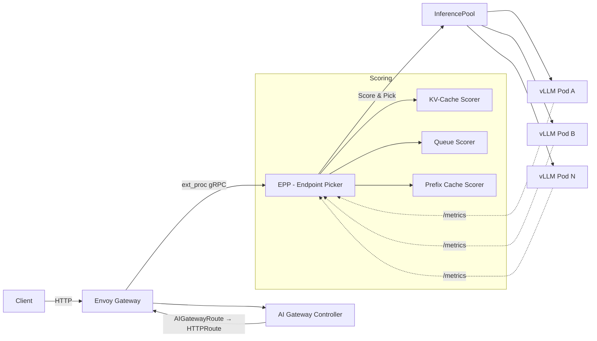
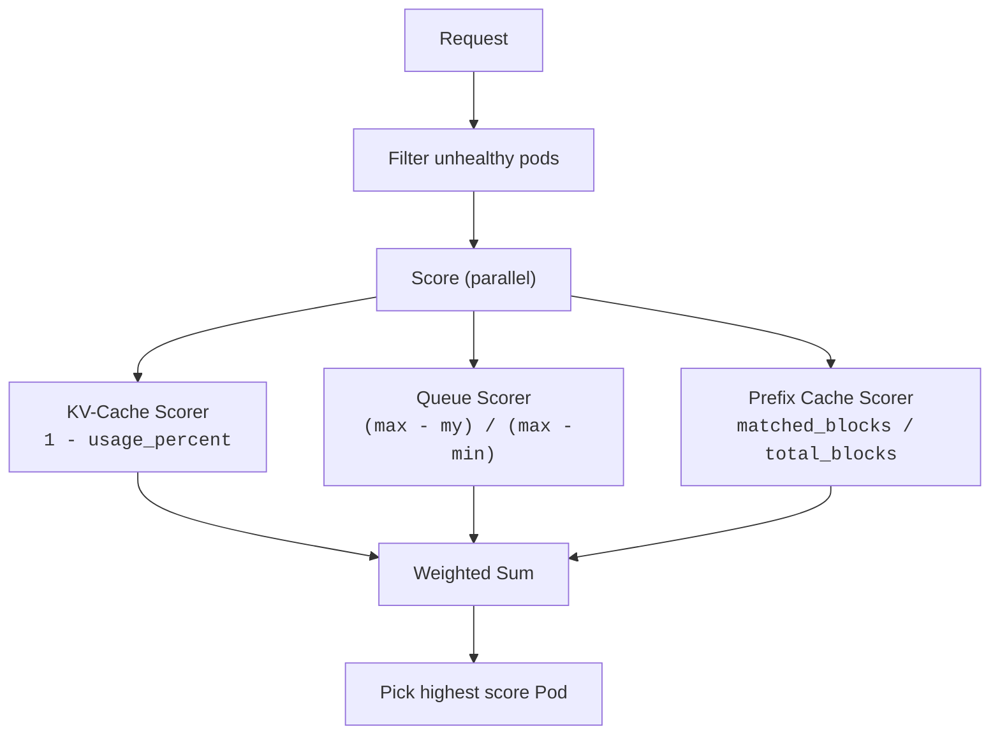

# Envoy AI Gateway + vLLM Semantic Router Lab

Envoy AI Gateway와 vLLM Semantic Router를 Kubernetes에서 통합하는 환경 구성 및 EPP 스마트 라우팅 분석.

## Architecture



## Components

| Component | Role |
|-----------|------|
| **Envoy Gateway** | Core traffic management, L7 proxy |
| **AI Gateway Controller** | `AIGatewayRoute` → `HTTPRoute` 변환, LLM provider 추상화 |
| **Semantic Router** | 요청 의미 기반 라우팅, 카테고리 분류 |
| **EPP (Endpoint Picker)** | 실시간 메트릭 기반 Pod 선택 (ext_proc) |
| **InferencePool** | vLLM Pod 그룹 + EPP 연결 정의 |
| **vLLM** | OpenAI-compatible LLM serving, GPU metrics 노출 |

## Quick Start

> 전체 설치 가이드는 [docs/INSTALLATION.md](docs/INSTALLATION.md) 참조.

```bash
# 1. Kind cluster
kind create cluster --name semantic-router-cluster

# 2. Semantic Router
helm install semantic-router oci://ghcr.io/vllm-project/charts/semantic-router \
  --version v0.0.0-latest \
  --namespace vllm-semantic-router-system --create-namespace \
  -f https://raw.githubusercontent.com/vllm-project/semantic-router/refs/heads/main/deploy/kubernetes/ai-gateway/semantic-router-values/values.yaml

# 3. Envoy Gateway
helm upgrade -i eg oci://docker.io/envoyproxy/gateway-helm \
  --version v0.0.0-latest \
  --namespace envoy-gateway-system --create-namespace \
  -f https://raw.githubusercontent.com/envoyproxy/ai-gateway/main/manifests/envoy-gateway-values.yaml

# 4. AI Gateway
helm upgrade -i aieg oci://docker.io/envoyproxy/ai-gateway-helm \
  --version v0.0.0-latest --namespace envoy-ai-gateway-system --create-namespace
helm upgrade -i aieg-crd oci://docker.io/envoyproxy/ai-gateway-crds-helm \
  --version v0.0.0-latest --namespace envoy-ai-gateway-system

# 5. Demo LLM + Gateway Resources
kubectl apply -f https://raw.githubusercontent.com/vllm-project/semantic-router/refs/heads/main/deploy/kubernetes/ai-gateway/aigw-resources/base-model.yaml
kubectl apply -f https://raw.githubusercontent.com/vllm-project/semantic-router/refs/heads/main/deploy/kubernetes/ai-gateway/aigw-resources/gwapi-resources.yaml
```

## EPP Scoring Overview

> 전체 소스코드 분석은 [docs/EPP_SCORING.md](docs/EPP_SCORING.md) 참조.

EPP는 요청마다 3개 scorer의 가중 합산 점수로 최적의 Pod을 선택합니다:



| Scorer | Input Metric | Formula | Characteristic |
|--------|-------------|---------|----------------|
| **KV-Cache** | `vllm:gpu_cache_usage_perc` | `1 - usage` | Absolute, stateless |
| **Queue** | `vllm:num_requests_waiting` | `(max-my)/(max-min)` | Relative, min-max normalized |
| **Prefix Cache** | Request prompt content | `matchBlocks/totalBlocks` | Content-aware, stateful (LRU) |

### Routing Decision Example

| | Pod A (busy, cached) | Pod B (idle, cold) |
|---|---|---|
| KV-Cache | 0.3 | 0.8 |
| Queue | 1.0 (queue=2, min) | 0.0 (queue=8, max) |
| Prefix | 0.9 (90% hit) | 0.0 |
| **Total** | **2.2** ✅ | **0.8** |

Prefix cache + 짧은 큐가 KV-cache 부족을 상쇄 → **Pod A 선택**.

## Documentation

| Document | Description |
|----------|-------------|
| [docs/INSTALLATION.md](docs/INSTALLATION.md) | 전체 설치 가이드 (Step-by-step) |
| [docs/EPP_SCORING.md](docs/EPP_SCORING.md) | EPP Scorer 소스코드 분석 (v1.3.1) |

## References

- [vLLM Semantic Router - AI Gateway Installation](https://vllm-semantic-router.com/docs/installation/k8s/ai-gateway)
- [Gateway API Inference Extension v1.3.1](https://github.com/kubernetes-sigs/gateway-api-inference-extension/tree/v1.3.1)
- [Envoy AI Gateway](https://github.com/envoyproxy/ai-gateway)