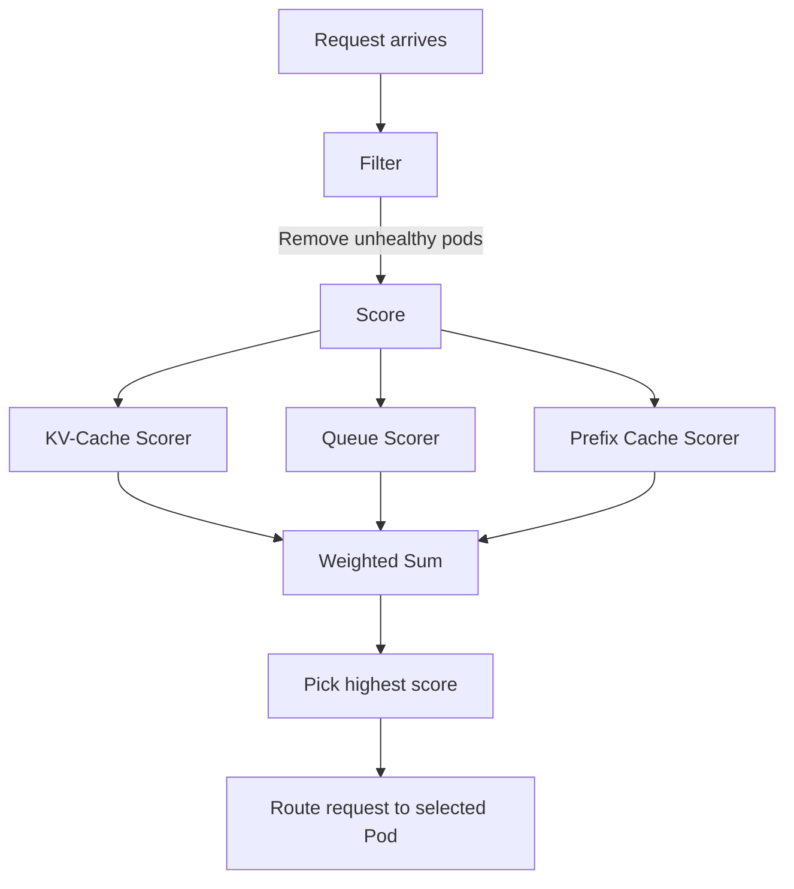
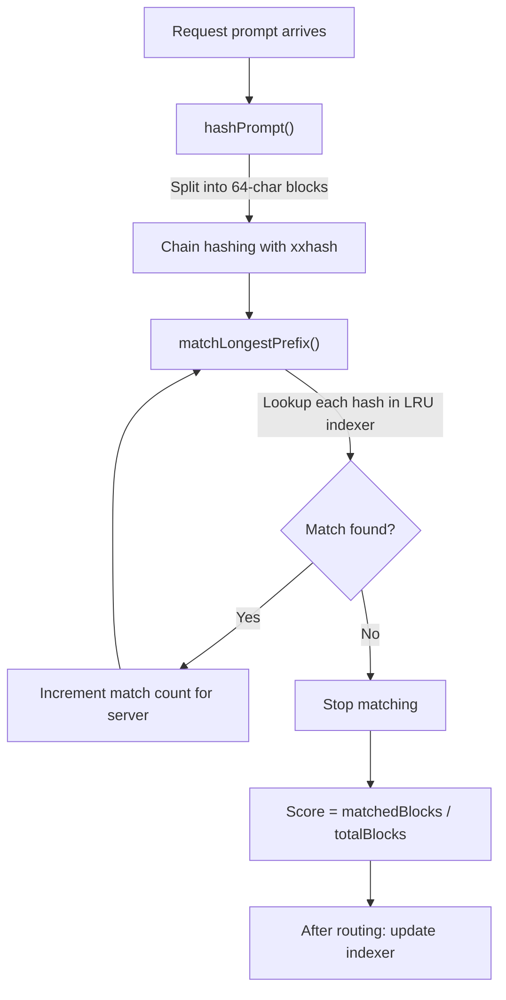

# EPP Scoring Deep Dive

> Source code analysis of [gateway-api-inference-extension v1.3.1](https://github.com/kubernetes-sigs/gateway-api-inference-extension/tree/v1.3.1).

EPP(Endpoint Picker)는 요청이 들어올 때마다 모든 후보 Pod에 점수를 매기고, 가장 높은 점수의 Pod으로 라우팅합니다. 점수는 여러 Scorer 플러그인의 가중 합산으로 결정됩니다.

## Scoring Pipeline



`WeightedScorer`는 단순히 Scorer를 감싸는 wrapper입니다:

```go
// pkg/epp/scheduling/framework/weighted_scorer.go
type WeightedScorer struct {
    Scorer
    weight int
}

func (s *WeightedScorer) Weight() int {
    return s.weight
}
```

---

## 1. KV-Cache Utilization Scorer

> **Source**: [`pkg/epp/scheduling/framework/plugins/scorer/kvcache_utilization.go`](https://github.com/kubernetes-sigs/gateway-api-inference-extension/blob/v1.3.1/pkg/epp/scheduling/framework/plugins/scorer/kvcache_utilization.go)

**Goal**: GPU KV-cache 사용률이 낮은 Pod을 선호

### Score Function (전체 코드)

```go
func (s *KVCacheUtilizationScorer) Score(
    _ context.Context,
    _ *types.CycleState,
    _ *types.LLMRequest,
    pods []types.Pod,
) map[types.Pod]float64 {
    scores := make(map[types.Pod]float64, len(pods))
    for _, pod := range pods {
        scores[pod] = 1 - pod.GetMetrics().KVCacheUsagePercent
    }
    return scores
}
```

**이게 전부입니다.** 단 한 줄: `1 - KVCacheUsagePercent`

### How It Works

| Pod | KVCacheUsagePercent | Score |
|-----|---------------------|-------|
| Pod A | 0.8 (80% used) | **0.2** |
| Pod B | 0.3 (30% used) | **0.7** |
| Pod C | 0.5 (50% used) | **0.5** |

→ **Pod B 선택** (KV-cache 여유 공간이 가장 많음)

### Why This Matters

vLLM은 추론 중 KV-cache를 GPU 메모리에 유지합니다. KV-cache가 가득 차면:

- 새 요청이 대기열에 쌓임
- 기존 요청의 KV 항목이 evict되어 재계산 필요
- 전체 throughput이 급격히 하락

따라서 **KV-cache 여유가 많은 Pod으로 보내는 것이 전체 클러스터 효율의 핵심**입니다.

### Metric Source

EPP는 vLLM의 `/metrics` 엔드포인트에서 `vllm:gpu_cache_usage_perc` 값을 주기적으로 수집합니다. 이 값이 `KVCacheUsagePercent`에 매핑됩니다.

---

## 2. Queue Depth Scorer

> **Source**: [`pkg/epp/scheduling/framework/plugins/scorer/queue.go`](https://github.com/kubernetes-sigs/gateway-api-inference-extension/blob/v1.3.1/pkg/epp/scheduling/framework/plugins/scorer/queue.go)

**Goal**: 대기열이 짧은 Pod을 선호

### Score Function (전체 코드)

```go
func (s *QueueScorer) Score(
    _ context.Context,
    _ *types.CycleState,
    _ *types.LLMRequest,
    pods []types.Pod,
) map[types.Pod]float64 {
    minQueueSize := math.MaxInt
    maxQueueSize := math.MinInt

    // Step 1: 전체 Pod의 min/max queue size 파악
    for _, pod := range pods {
        queueSize := pod.GetMetrics().WaitingQueueSize
        if queueSize < minQueueSize {
            minQueueSize = queueSize
        }
        if queueSize > maxQueueSize {
            maxQueueSize = queueSize
        }
    }

    // Step 2: min-max 정규화 점수 계산
    podScoreFunc := func(pod types.Pod) float64 {
        if maxQueueSize == minQueueSize {
            return 1.0  // 모든 Pod이 동일한 큐 크기면 동점
        }
        return float64(maxQueueSize-pod.GetMetrics().WaitingQueueSize) /
               float64(maxQueueSize-minQueueSize)
    }

    scores := make(map[types.Pod]float64, len(pods))
    for _, pod := range pods {
        scores[pod] = podScoreFunc(pod)
    }
    return scores
}
```

### How It Works

KV-Cache scorer와 달리, **min-max 정규화**를 사용합니다:

```
Score = (maxQueue - myQueue) / (maxQueue - minQueue)
```

| Pod | WaitingQueueSize | Score |
|-----|------------------|-------|
| Pod A | 10 (max) | **(10-10)/(10-2) = 0.0** |
| Pod B | 2 (min) | **(10-2)/(10-2) = 1.0** |
| Pod C | 6 | **(10-6)/(10-2) = 0.5** |

→ **Pod B 선택** (대기열이 가장 짧음)

### Key Characteristics

- 모든 Pod의 큐 크기가 같으면 (`maxQueue == minQueue`) 전부 1.0점 → 다른 scorer에 위임
- **절대값이 아닌 상대값** 기반: 큐 크기 100 vs 120일 때도 0과 1로 벌어짐

### Metric Source

vLLM의 `vllm:num_requests_waiting` 메트릭이 `WaitingQueueSize`에 매핑됩니다.

---

## 3. Prefix Cache Scorer

> **Source**: [`pkg/epp/scheduling/framework/plugins/multi/prefix/plugin.go`](https://github.com/kubernetes-sigs/gateway-api-inference-extension/blob/v1.3.1/pkg/epp/scheduling/framework/plugins/multi/prefix/plugin.go)

**Goal**: 동일한 프롬프트 접두사(prefix)를 캐시하고 있는 Pod을 선호하여 캐시 히트율 극대화

이 플러그인은 다른 scorer와 근본적으로 다릅니다. GPU 메트릭이 아니라 **요청 내용 자체를 분석**합니다.

### Core Idea

vLLM은 동일한 프롬프트 접두사에 대해 KV-cache를 재사용합니다 (`--enable-prefix-caching`). 이전 요청이 "Explain quantum computing in detail..." 로 시작했고, 새 요청도 동일한 접두사로 시작하면, 그 KV-cache를 재사용할 수 있어 **TTFT(Time To First Token)가 극적으로 감소**합니다.

EPP의 Prefix Cache Scorer는 이를 **Gateway 레벨에서 추적**합니다.

### Pipeline



### Step 1: Prompt Hashing (`hashPrompt`)

```go
// 프롬프트를 블록 단위로 분할하고 체인 해싱
// hash[0] = xxhash(block[0] + model_name)
// hash[i] = xxhash(block[i] + hash[i-1])
//
// DefaultBlockSize = 64 chars (vLLM 기본 token block 16 × 평균 4 chars/token)
```

프롬프트 "Hello world, explain quantum computing..." 이 들어오면:

```
Block 0: "Hello world, explain quantum computing in detail. The concept..." (64 chars)
Block 1: " of superposition means that a quantum bit can exist in multi..." (64 chars)
Block 2: "ple states simultaneously. This is fundamentally different fro..." (64 chars)
        ↓
hash[0] = xxhash("Block 0 content" + "model_name")
hash[1] = xxhash("Block 1 content" + hash[0])
hash[2] = xxhash("Block 2 content" + hash[1])
```

### Step 2: Longest Prefix Match (`matchLongestPrefix`)

```go
func (p *Plugin) matchLongestPrefix(ctx context.Context, hashes []BlockHash) map[ServerID]int {
    res := make(map[ServerID]int)
    for i := 0; i < len(hashes); i++ {
        hash := hashes[i]
        cachedServers := p.indexer.Get(hash)
        if len(cachedServers) == 0 {
            break  // 더 이상 매칭되는 서버 없음 → 중단
        }
        for server := range cachedServers {
            res[server]++  // 이 서버의 매칭 길이 증가
        }
    }
    return res
}
```

블록을 순서대로 검사하면서 "이 해시를 캐시하고 있는 서버"를 찾습니다. 매칭이 끊기면 즉시 중단합니다.

### Step 3: Scoring (`Score`)

```go
scores := make(map[types.Pod]float64, len(pods))
total := len(state.PrefixHashes)

podScoreFunc := func(pod types.Pod) float64 {
    if total == 0 {
        return 0
    }
    matchLen := state.PrefixCacheServers[ServerID(pod.GetPod().NamespacedName)]
    return float64(matchLen) / float64(total)
}
```

**Score = 매칭된 블록 수 / 전체 블록 수**

| Pod | Cached prefix blocks | Score |
|-----|----------------------|-------|
| Pod A | 8/10 matched | **0.8** |
| Pod B | 0/10 matched | **0.0** |
| Pod C | 3/10 matched | **0.3** |

→ **Pod A 선택** (프롬프트의 80%가 이미 캐시되어 있으므로 TTFT 최소화)

### Step 4: Index Update After Routing (`PreRequest`)

요청이 실제로 라우팅된 후, 해당 Pod의 인덱서에 이 프롬프트의 해시를 기록합니다:

```go
func (p *Plugin) PreRequest(ctx context.Context, request *types.LLMRequest,
    schedulingResult *types.SchedulingResult) {
    // ...
    go func() {
        for _, s := range servers {
            p.indexer.Add(state.PrefixHashes, s)
        }
    }()
}
```

이로써 다음에 비슷한 프롬프트가 오면 이 Pod으로 라우팅됩니다.

### Design Insights

- **Approximation**: 실제 vLLM 내부 prefix cache 상태를 정확히 알 수 없으므로, EPP가 자체 LRU 인덱서로 **추정**
- **LRU Capacity**: H100 80GB 기준 — 모델 16GB, 나머지 64GB가 캐시, 토큰당 128KB → 약 31,250 블록 (`DefaultLRUCapacityPerServer`)
- **AutoTune**: `autoTune: true` 설정 시, 실제 Pod의 `CacheNumGPUBlocks` 메트릭을 사용하여 LRU 용량 자동 조정
- **Chain Hashing**: `hash[i] = xxhash(block[i] + hash[i-1])` 구조로 순서 의존성 보장 — 같은 블록이라도 위치가 다르면 다른 해시

---

## Scorer Comparison

| Scorer | Input | Formula | Characteristic |
|--------|-------|---------|----------------|
| **KV-Cache** | `gpu_cache_usage_perc` | `1 - usage` | Absolute, stateless |
| **Queue** | `num_requests_waiting` | `(max-my)/(max-min)` | Relative, min-max normalized |
| **Prefix Cache** | Request prompt content | `matchBlocks/totalBlocks` | Content-aware, stateful (LRU) |

## Configuration Example

```yaml
# EndpointPickerConfig
plugins:
  - type: queue-scorer
  - type: kv-cache-utilization-scorer
  - type: prefix-cache-scorer
schedulingProfiles:
  - name: default
    plugins:
      - pluginRef: queue-scorer
      - pluginRef: kv-cache-utilization-scorer
      - pluginRef: prefix-cache-scorer
```

모든 scorer가 동일 가중치(기본 1)로 설정되면, 최종 점수는 3개 scorer 점수의 단순 합산입니다.

---

## Routing Simulation

### Scenario 1: Idle Pod B wins

요청: 긴 프롬프트, 이전에 Pod A로 비슷한 요청을 보낸 적 있음

| | Pod A | Pod B |
|---|---|---|
| KV-Cache Score | 0.3 (70% used) | 0.8 (20% used) |
| Queue Score | 0.4 (queue 6) | 1.0 (queue 0) |
| Prefix Score | 0.9 (90% cache hit) | 0.0 (no cache) |
| **Total** | **1.6** | **1.8** |

→ **Pod B 선택.** KV-cache 여유와 빈 큐가 prefix cache 이점을 상회.

### Scenario 2: Cached Pod A wins

동일 요청이지만 Pod B의 큐가 8개라면?

| | Pod A | Pod B |
|---|---|---|
| KV-Cache Score | 0.3 | 0.8 |
| Queue Score | 1.0 (queue 2 = min) | 0.0 (queue 8 = max) |
| Prefix Score | 0.9 | 0.0 |
| **Total** | **2.2** | **0.8** |

→ **Pod A 선택.** Prefix cache와 짧은 큐가 KV-cache 부족을 상쇄.

---

## References

- [EPP Scorer: kvcache_utilization.go](https://github.com/kubernetes-sigs/gateway-api-inference-extension/blob/v1.3.1/pkg/epp/scheduling/framework/plugins/scorer/kvcache_utilization.go)
- [EPP Scorer: queue.go](https://github.com/kubernetes-sigs/gateway-api-inference-extension/blob/v1.3.1/pkg/epp/scheduling/framework/plugins/scorer/queue.go)
- [EPP Scorer: prefix/plugin.go](https://github.com/kubernetes-sigs/gateway-api-inference-extension/blob/v1.3.1/pkg/epp/scheduling/framework/plugins/multi/prefix/plugin.go)
- [EPP Framework: weighted_scorer.go](https://github.com/kubernetes-sigs/gateway-api-inference-extension/blob/v1.3.1/pkg/epp/scheduling/framework/weighted_scorer.go)